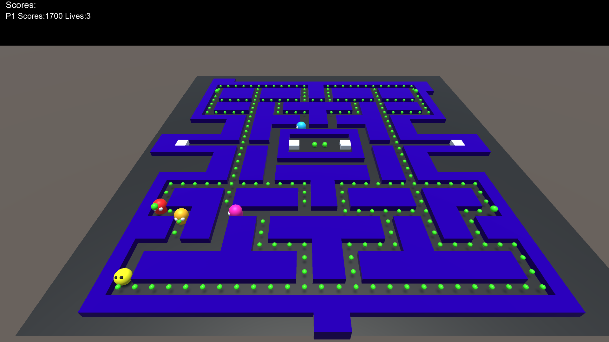

# pacmanecs
This is a simple example of PacMan-game using Entity-Component-System implementation [LeoECS-classic](https://github.com/Leopotam/ecs).\
It's a fine example of how to use the classic Leopotam ECS framework and how to use itself ECS architecture in your Unity game.\
But be aware, the project has no best practices and **must be used only as an example, not as a guide**!

